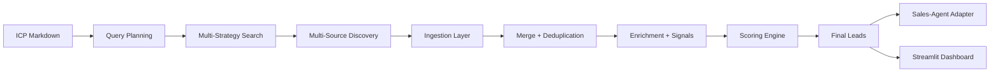

# Sales Intelligence Pipeline

An end-to-end lead discovery system that transforms an ICP definition into high-quality, ranked leads with automated outreach generation and a reviewable dashboard.

---

## Overview

This system is designed as a modular intelligence pipeline that separates **discovery, enrichment, and decision-making**.

Instead of treating lead generation as scraping, it approaches it as a **multi-stage reasoning problem**:

* What companies match the ICP
* Where to find them across fragmented sources
* How to validate and enrich them
* How to rank them based on intent signals

---

## System Flow



---

## Core Concepts

### ICP → Structured Intent

The pipeline starts with a markdown ICP and converts it into:

* search strategies
* keywords
* company patterns

This becomes the foundation for all downstream discovery.

---

### Multi-Source Discovery

Leads are not pulled from a single source. The system aggregates across:

* job boards
* product platforms
* review sites
* social signals
* company footprints

This reduces source bias and increases recall.

---

### Deterministic + LLM Hybrid Pipeline

* Deterministic layers ensure consistency (merge, dedupe, validation)
* LLM layers handle ambiguity (query generation, entity extraction)

This balance keeps the system both **robust and adaptive**.

---

### Signal-Based Scoring

Leads are ranked using:

* hiring signals
* growth indicators
* tech stack relevance
* activity signals

The goal is not just matching ICP, but identifying **high-intent companies**.

---

## Outputs

* `output/ingested_leads.json` → raw aggregated leads
* `output/leads.json` → final cleaned and scored leads
* `existing_pipeline_output.json` → dashboard input
* `generated_emails.json` → outreach drafts
* `sent_logs.json` → outbound logs
* `replies.json` → response tracking

---

## Project Structure

```
/core            → ingestion, normalization, validation
/discovery       → ICP parsing, query planning, search strategies
/intelligence    → signals, scoring, reasoning layers
/agents          → domain-specific enrichment agents
/sources         → external data connectors
/scripts         → execution entry points
/app             → Streamlit interface
/learning        → feedback and adaptive improvements
```

---

## How To Run

### 1. Run the Pipeline

```bash
export TEST_MODE=0
export ICP_MARKDOWN_PATH=sample_company.md

python main.py
```

---

### 2. Launch Dashboard

```bash
streamlit run app.py
```

---

### 3. Generate Outreach

```bash
python scripts/salesgpt_lead_adapter.py
```

---

## Environment Variables

* `GROQ_API_KEY` → primary LLM provider
* `GEMINI_API_KEY` → optional fallback
* `TEST_MODE=1` → faster, limited pipeline for testing

---

## Design Principles

* Separation of concerns across pipeline stages
* Multi-source discovery over single-source dependency
* Hybrid deterministic + LLM architecture
* Signal-driven ranking instead of static filtering
* Extensible agents for domain-specific enrichment

---

## What Not To Commit

Generated runtime artifacts should be excluded:

```
output/
*.json (runtime outputs)
*.log
```

Vendored directories under `/external` and `/Sales-Agent` are included as dependencies but are not part of the core system.

---

## Status

Actively evolving system focused on improving:

* ingestion reliability
* signal quality
* lead scoring accuracy
* multi-region discovery

---
